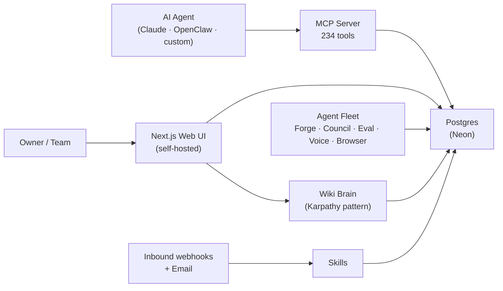

# FusionClaw 🦞

<p align="center">
  
</p>

> _"All hustle. No luck. One database."_

<p align="center">
  <strong>The agent-native business operating system. CRM, operations, content, finance, and marketing on one Postgres database — with a self-improving agent fleet (Skill Forge, Council mode, Eval Studio, Karpathy reflection loop) and 234 MCP tools that let any AI agent (Claude, OpenClaw, custom) operate the whole platform with one API key.</strong><br />
  Self-hosted. MIT-licensed. Dark mode only.
</p>

---

## Quick start

| Card                          | Link                                                                                                          |
| ----------------------------- | ------------------------------------------------------------------------------------------------------------- |
| 🚀 **Get Started**            | [start/getting-started](start/getting-started.md) — install in 60 seconds                                     |
| 🛠️ **Install**                 | [install/local](install/local.md) · [install/docker](install/docker.md) · [install/vercel](install/vercel.md) |
| 🤖 **Connect an agent**       | [snippets/claude-code-config](snippets/claude-code-config.md)                                                 |
| 🪄 **Build your first skill** | [concepts/skill-forge](concepts/skill-forge.md)                                                               |
| 🧠 **Wiki Brain**             | [concepts/wiki-brain](concepts/wiki-brain.md)                                                                 |

---

## What is FusionClaw?

FusionClaw is a **self-hosted business operating system** with a **self-improving agent fleet built into the metal.** CRM, operations, content, finance, and marketing live on one Postgres database. An agent fleet runs alongside — generating skills, evaluating them, debating deals via Council mode, executing voice flows via OpenAI Realtime, browsing the web for intel, picking the cheapest model that meets your eval bar.

Two surfaces, one database:
- **Web UI** — what you (the human) use day-to-day
- **MCP server (234 tools)** — what your AI agent uses to operate everything programmatically

**Who is it for?**

- Solo founders running a business with a small team
- Agencies managing clients, leads, content, and campaigns
- AI-first operators who want their agent to actually *do* things — and *get better* at doing them — not just answer questions
- Developers who want a self-hostable agent platform they can extend or fork

**What makes it different?**

Most CRMs added a chat sidebar. FusionClaw is built around a self-improving agent fleet:

- 🪄 **Skill Forge** — type a one-line goal, get a working skill (prompt + eval criteria + seed test cases) in 5 seconds
- 🧠 **Karpathy reflection loop** — every Monday at 6am the worst-performing skill gets analyzed and 3 prompt edits proposed
- ⚡ **Reasoning trace streaming** — watch agents think live; tool calls render as expandable nodes, final output as interactive UI
- 🎨 **Generative UI** — skills return scorecards, email previews, intel cards — not walls of text
- 🧪 **Eval Studio** — per-skill test cases with pass/fail matrix; 80% rate gates promotion to production
- 👥 **Council mode** — 3 agents (Sales, Researcher, Closer) debate every deal, then synthesize a verdict
- 🎙️ **Voice agent** — full-duplex via OpenAI Realtime; talk to your CRM, run skills, create tasks
- 🌐 **Browser-using skills** — hand a URL, get back structured intel; Stagehand-ready for full automation
- 💰 **Cost-optimized routing** — Thompson sampling bandit picks the cheapest model that hits your eval bar
- 📚 **Wiki memory** — the agent's memory layer is a transparent wiki you can read, edit, and curate (no opaque vector DB)
- 🛒 **Skill Marketplace** — one-click install of curated templates with seed evals included
- 🔗 **Webhooks · Workflows · Activity Stream** — inbound webhooks fire skills; outbound webhooks fire on lead/task/skill events; live activity stream shows every run + cost + latency

**Plus the standard business OS:**

- 📊 **CRM & Pipeline** — TanStack Virtual table handling 37k+ rows, drag-and-drop kanban, full lead lifecycle
- ⚙️ **Operations** — shift tracking, daily checklists, task management, employee accountability reports
- 💵 **Finance** — invoices with line items, expense tracking (10 categories), P&L dashboard, quarterly tax estimates
- 🎨 **Content & Marketing** — OpenRouter streaming chat, fal.ai image generation, WordPress publishing, AI content queue

**What do you need?**

- Node 20+
- A free [Neon](https://neon.tech) Postgres URL (works on free tier)
- 60 seconds

---

## How it works



The database is the single source of truth. Three things write to it: the human (web UI), the agent (MCP), and the agent fleet (skills, council, eval). Three things read from it for outbound flows: outbound webhooks, the activity stream, and the agent's wiki memory.

---

## Three install paths

| Path       | Command                                              | Time | Guide                              |
| ---------- | ---------------------------------------------------- | ---- | ---------------------------------- |
| **Local**  | `curl -fsSL fusionclaw.app/install.sh \| bash`        | ~60s | [install/local](install/local.md)  |
| **Docker** | `curl -fsSL fusionclaw.app/install-docker.sh \| bash` | ~90s | [install/docker](install/docker.md) |
| **Vercel** | One-click deploy → fork → live URL                   | ~90s | [install/vercel](install/vercel.md) |

All three produce a working dashboard in under two minutes.

---

## Connect your agent

Add this to `~/.claude/mcp_servers.json`:

```json
{
  "mcpServers": {
    "fusionclaw": {
      "command": "node",
      "args": ["/absolute/path/to/FusionClaw/mcp-server/dist/index.js"],
      "env": {
        "MCP_API_KEY": "fusionclaw_sk_live_...",
        "DATABASE_URL": "postgresql://..."
      }
    }
  }
}
```

Restart Claude Code → run `/mcp` → 234 tools available. Full reference: [reference/mcp-tools](reference/mcp-tools.md).

---

## Start here

| Section                        | What's there                                                                                                                                                                              |
| ------------------------------ | ----------------------------------------------------------------------------------------------------------------------------------------------------------------------------------------- |
| [start/](start/)               | Getting started · what FusionClaw is · the first 10 minutes                                                                                                                               |
| [install/](install/)           | Local · Docker · Vercel install paths                                                                                                                                                     |
| [concepts/](concepts/)         | Agent-native · MCP server · Wiki Brain · Skill Forge · Council mode · Eval Studio · reflection loop · voice agent · browser skills · cost routing · self-hosted auth · design system    |
| [modules/](modules/)           | Per-module guides — Dashboard, Today, Tasks, Leads, Wiki Brain, Skills, Council, Eval, Voice, etc.                                                                                       |
| [reference/](reference/)       | MCP tool catalog · API routes · database schema · env vars · webhook formats                                                                                                              |
| [integrations/](integrations/) | OpenRouter · fal.ai · OpenAI Realtime · ElevenLabs · Resend · Vercel Blob · Google Workspace                                                                                              |
| [security/](security/)         | Auth · OWNER_PASSWORD · MCP key · webhook secrets · deployment hardening                                                                                                                  |
| [help/](help/)                 | FAQ · troubleshooting · install issues · contact                                                                                                                                          |
| [snippets/](snippets/)         | Copy-paste config blocks                                                                                                                                                                  |
| [plugins/](plugins/)           | Plugin authoring (v1.1+)                                                                                                                                                                  |

---

## Learn more

- [VISION.md](../VISION.md) — what FusionClaw is for and where it's going
- [CHANGELOG.md](../CHANGELOG.md) — release history
- [CONTRIBUTING.md](../CONTRIBUTING.md) — how to contribute
- [SECURITY.md](../SECURITY.md) — responsible disclosure
- [Discord](#) — community + help (link in repo description)
- [GitHub Discussions](https://github.com/Fusion-Data-Company/FusionClaw/discussions) — async / long-form

---

**FusionClaw** — Built by [Rob Yeager](https://github.com/Rob-Yeager) at [Fusion Data Company](https://fusiondataco.com). MIT licensed.
